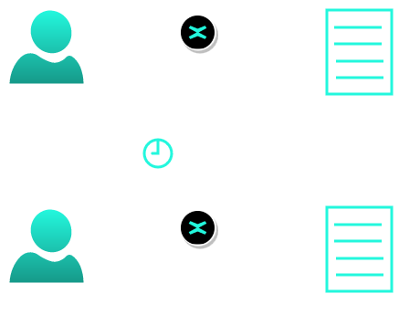
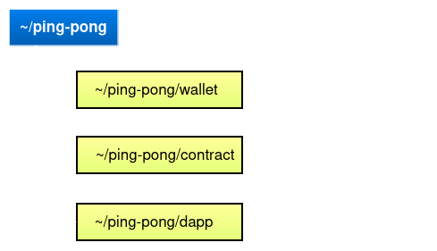

# Decentralized Applications

## Objectives:
* In this lab you will build your first decentralized application (dApp);
* You will create a ping pong application where you will:
    * Create an User Interace (template provided);
    * Login via private key (pem, Chrome extension);
    * Create a Smart contract (template provided);
    * Interact with the User Interace and observe the blockchain transaction;

## dApp Description

The Ping-Pong app is a very simple decentralized application that will allow the user to deposit a specific number of tokens to a smart contract address and to lock them for a specific amount of time.
After this time interval passes, the user can claim back the same amount of tokens.

Sending funds to the contract is called **ping**.

Claiming the same amount back is called **pong**.



## Prerequisites

Before starting, make sure you have the following:
- `stable` Rust version `≥ 1.78.0` (install via [rustup](https://docs.multiversx.com/sdk-and-tools/troubleshooting/rust-setup/#without-mxpy))
- `multiversx-sc-meta` (cargo install [multiversx-sc-meta](https://docs.multiversx.com/developers/meta/sc-meta-cli/#introduction))
- `Node.js` with version `≥ 18`(guide [here](https://nodejs.org/en/download/package-manager))
- `yarn` ([npm install --global yarn](https://classic.yarnpkg.com/lang/en/docs/install/#debian-stable) )

We are going to use `sc-meta` to:
1. **Create a wallet** to handle your transactions.
2. **Build** and **deploy** a contract. 

## dApp architecture


### Application Layer (The Frontend)

For the web app we'll have two pages:

* The **Sign-in** page - here we can authenticate with ledger, web wallet or with xPortal app
* The **Dashboard** page - here we can either ping or pong, if we have already deposited, then we will see a countdown timer until the time interval clears.

### Blockchain Layer (The Backend)

We will create a smart contract that can handle:
- `ping`: user sends some EGLD to be locked in the contract for a period of time;
- `pong`: user can take back funds from the contract;
- `pongAll`: all users who deposited can take back funds from the contract;
- `getUserAddresses`: **view** that lists the addresses of all users that have `ping`-ed in the order they have `ping`-ed;
- `getContractState`: **view** that returns the current contract state as a _ContractState_ structure;
- `getPingAmount`: **storage mapper** that saves the total EGLD deposit;
- `getDeadline`: **storage mapper** that saves the amount of time until the EGLD is deposited;
- `activationTimestamp`: **storage mapper** that saves the timestamp of the block where the contract got activated. If it is not specified in the constructor it is the deploy block timestamp.
- `maxFunds`: **storage mapper** that saves the funding limit if it was set in _init_. 
- `user`: **storage mapper** that saves information about the user who deposited. 
- `userStatus`: **storage mapper** that saves the state of user funds:
  - **0** - user unknown, never `ping`-ed;
  - **1** - `ping`-ed;
  - **2** - `pong`-ed.
- `pongAllLastUser`: **storage mapper** that saves the completion status of the last user. It is part of the `pongAll` status. It stores:
    - `0` if `pongAll` was never called;
    - the index of the last user.
- `ping_event`: **event** that signals a successful `ping` by the user with amount;
- `pong_event`: **event** that signals a successful `pong` by the user with amount;
- `pong_all_event`: **event** that signals the beginning of the `pongAll` operation, status and last user.

Let's say that, for now, this smart contract plays the role of an API in a dApp. Also, this is where our business logic resides.

The [MultiversX _devnet_](https://devnet-explorer.multiversx.com/) is a public test network maintained by our community where any developer can test their smart contracts and dApps in a real world environment.


## **Set up the environment**

Let's set up the environment for getting your first dapp up and running.

[comment]: # (mx-context-auto)

### **Project Structure**

First let's create a new folder for our project, I'll name it `ping-pong`.

```sh
mkdir -p ping-pong/wallet
cd ping-pong
```

In the end, we will have three subfolders: wallet, contract and dapp. For convenience, we'll save our owner's PEM wallet in the wallet folder.



[comment]: # (mx-context-auto)

### **Create the owner wallet**

The smart contract can only be deployed on the blockchain by an owner, so let's create an owner's wallet **PEM file**. The owner can also update the contract, later on, if needed. Keep in mind we only use PEM wallets for testing and playing around with non-production code. For real applications please follow best practices, use secure wallets that can be generated [here](https://wallet.multiversx.com).

First, make sure you are in the `ping-pong` folder.

```sh
sc-meta wallet new --format pem --outfile ./wallet/wallet-owner.pem
```

In order to initiate transactions on the blockchain, we need some funds, every transaction costs a very small fee, on the blockchain this is called **gas**.

On the devnet wallet we have a **faucet** that allows you to get free test funds for our applications. You can log in with your PEM using the newly generated PEM file. Use the faucet from the menu as you see below and you are all set.

[comment]: # (mx-exclude-context)

## **The Blockchain Layer - The Smart Contract**

Our owner wallet is completely set now, we can move on to our backend, the blockchain layer.

[comment]: # (mx-context-auto)

### **Clone the template**


Let's start with our smart contract. We'll first clone the Ping-Pong sample contract repository from [here](https://github.com/multiversx/mx-ping-pong-sc).

Also make sure you are still in the **ping-pong** folder.

```sh
git clone https://github.com/multiversx/mx-ping-pong-sc contract
```

[comment]: # (mx-context-auto)

### **Build the Smart Contract**

We now have the source code for the smart contract, but we need to compile it into a _binary_ that the **MultiversX Virtual Machine** can run. The VM can run Web Assembly code, so we need to compile our Rust source code into Web Assembly (WASM).

Run the following command in order to build the rust smart contract into a _wasm file_.

```sh
cd contract/ping-pong
sc-meta all build
```

When running the build command, a WASM file gets created: `output/ping-pong.wasm`. This file contains the bytecode of our smart contract.

[comment]: # (mx-context-auto)

### **Customize and Deploy**

Next step is to deploy the smart contract to the blockchain.

Make sure `wallet_owner.pem` is in the right folder, the smart contract is built and let's get to the deployment.
For now let's continue with the default values.

At path `contract/ping-pong/interact` we will run:

```bash
cargo run deploy --ping-amount 5 --duration-in-seconds 300
```

We'll take a look at the log output. We have 2 elements that need our attention: the contract address and the transaction hash. Let's check them in the [Devnet Explorer](https://devnet-explorer.multiversx.com).

Devnet Explorer will be your best friend in developing dApps on the MultiversX Blockchain, as you'll first deploy and test your dApps on Devnet.

```sh
    Finished `dev` profile [unoptimized + debuginfo] target(s) in 0.09s
    Running `/ping-pong/contract/target/debug/ping-pong-interact deploy --ping-amount 5 --duration-in-seconds 30`
wallet address: erd1z32fx8l6wk9tx4j555sxk28fm0clhr0cl88dpyam9zr7kw0hu7hsx2j524
sender's recalled nonce: 2792
-- tx nonce: 2792
sc deploy tx hash: dff1a89781fa99a9d58bdef64d7c5ed08a18cb4366a90d15d0d8e324bef1ff46
deploy address: erd1qqqqqqqqqqqqqpgq4c7tawwwuw8trvf7vx2g48h6tc36u42nqqes9caejv
new address: serd1qqqqqqqqqqqqqpgq4c7tawwwuw8trvf7vx2g48h6tc36u42nqqes9caejv
```

The smart contract is now deployed on the blockchain. We can interact with it using blockchain transactions in order to invoke smart contract functions `ping` or `pong`.

The smart contract source code resides in `ping-pong/contract/ping-pong/src/ping_pong.rs`.

There are two main functions: `ping`, `pong` and `pongAll` these are invoked using blockchain transactions.

We also have other functions defined in the smart contract: `getUserAddresses`, `getContractState`, `getPingAmount`, `getDeadline`, `getActivationTimestamp`, `getMaxFunds`, `getUserStatus` and `pongAllLastUser` `. These functions are view and are invoked using [**MultiversX API**](*https://devnet-gateway.multiversx.com/#/vm-values/post_vm_values_query*).

[comment]: # (mx-exclude-context)

## **The Application Layer - The Web App**

All right, let's move on to the application layer.

[comment]: # (mx-context-auto)

### **Clone the Sample App**

First make sure to go back to the root `ping-pong` folder.

We will clone a very simple dApp template that implements the calls to our newly deployed smart contract.

```sh
git clone https://github.com/multiversx/mx-template-dapp dapp
cd dapp
```

[comment]: # (mx-context-auto)

### **Configure the app**

Use the preferred editor and customize the Smart Contract Address located in `src/config/config-devnet.tsx`

Then edit this instruction, and change it to the contract address that was shown in the [previous step](./your-first-dapp.md#customize-and-deploy).


[comment]: # (mx-context-auto)

### **Build the dApp**

Please make sure you have [**yarn installed**](https://classic.yarnpkg.com/lang/en/docs/install) on your machine.

At path `ping-pong/dapp` we will install the dependencies:

```sh
npm install --global yarn
yarn add vite --dev
```

Then we will start a development server to test our new dApp:

```sh
yarn start:devnet
```

**Run it on local machine (or host it on your server)**
If you start the development server on the local machine, then open [https://localhost:3000](https://localhost:3000) in your browser.

If you start it on your own server, then you can access [http://ip:3000](http://ip:3000). The built version only contains static files, so any hosting provider will do.

After you start the development server, when you see the _Template dApp_ screen, this means the application is up and running.


[comment]: # (mx-context-auto)

## **Try your Application**

We will sign in with a test wallet.

To do this, we will press **Connect** button and choose **Web Wallet** option.


After you access **Web Wallet** connection, you will be forwarded to login on [Multiversx Wallet](https://devnet-wallet.multiversx.com/unlock/pem).


You will choose PEM option to login. You can reuse the same owner's wallet if you want to, or an old one.

[comment]: # (mx-context-auto)

### **Ping Feature**

After signing in, we'll see the dashboard where we can see the **Ping** button.

Click the **Ping** button and you'll be redirected to the authentication page on the web wallet.


A new transaction will be created and you'll be asked to confirm it. This transaction transfers balance from your wallet to the smart contract address. Those funds will be locked for the specified period of time. Pay attention to the data field, where we call the smart contract function `ping`.

After you confirm the transaction, a success message will appear and the funds are locked.

**Wait the time interval**
You can see the amount of time you'll have to wait until you can pong.

[comment]: # (mx-context-auto)

### **Pong Feature**

After the time interval has passed, you can claim the funds by clicking the Pong button.
Another blockchain transaction will wait to be processed, this time the amount will be zero, as we only have to invoke the `pong` function (specified in the _data_ field).
The transaction will trigger a success message and the funds will be returned to the wallet.
