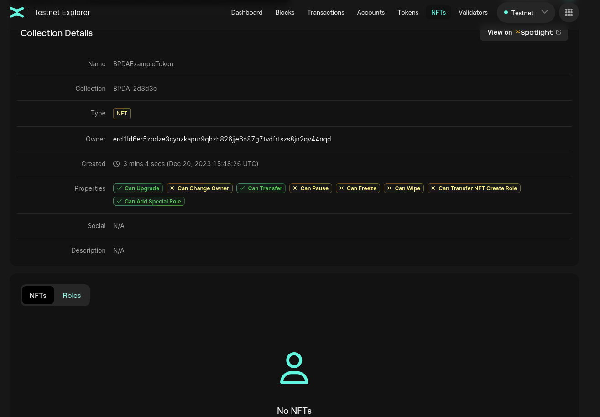

# Non-Fungible Tokens (NFTs)

These NFTs are unique, one-of-a-kind tokens that are built on blockchain technology, allowing for secure ownership and transfer of these assets.
Every token is assigned a unique identification code(ticker) and metadata that distinguishes it from every other token.

The flow of issuing and transferring non-fungible tokens is:
* register/issue the token (this step creates an empty collection);
* set roles to the address that will create the NFT/SFTs;
* create the NFT/SFT;
* transfer quantity(es).


## Issuance of NFT tokens

One has to perform an issuance transaction in order to register a non-fungible token.
Non-Fungible Tokens are issued via a request to the Metachain, which is a transaction submitted by the Account which will manage the tokens.
When issuing a token, one must provide a **token name**, a **ticker** and optionally **additional properties**. This transaction has the form:

```
IssuanceTransaction {
    Sender: <account address of the token manager>
    Receiver: erd1qqqqqqqqqqqqqqqpqqqqqqqqqqqqqqqqqqqqqqqqqqqqqqqzllls8a5w6u
    Value: 50000000000000000 # (0.05 EGLD)
    GasLimit: 60000000
    Data: "issueNonFungible" +
          "@" + <token name in hexadecimal encoding> +
          "@" + <token ticker in hexadecimal encoding>
}

```

Optionally, the properties can be set when issuing a token. Example:

```
IssuanceTransaction {
    Sender: <account address of the token manager>
    Receiver: erd1qqqqqqqqqqqqqqqpqqqqqqqqqqqqqqqqqqqqqqqqqqqqqqqzllls8a5w6u
    Value: 50000000000000000 # (0.05 EGLD)
    GasLimit: 60000000
    Data: "issueNonFungible" +
          "@" + <token name in hexadecimal encoding> +
          "@" + <token ticker in hexadecimal encoding> +
          "@" + <"canFreeze" hexadecimal encoded> + "@" + <"true" or "false" hexadecimal encoded> +
          "@" + <"canWipe" hexadecimal encoded> + "@" + <"true" or "false" hexadecimal encoded> +
          "@" + <"canPause" hexadecimal encoded> + "@" + <"true" or "false" hexadecimal encoded> +
          "@" + <"canTransferNFTCreateRole" hexadecimal encoded> + "@" + <"true" or "false" hexadecimal encoded> +
          "@" + <"canChangeOwner" hexadecimal encoded> + "@" + <"true" or "false" hexadecimal encoded> +
          "@" + <"canUpgrade" hexadecimal encoded> + "@" + <"true" or "false" hexadecimal encoded> +
          "@" + <"canAddSpecialRoles" hexadecimal encoded> + "@" + <"true" or "false" hexadecimal encoded> +
          ...
}
```

### Practice

Let's create our first NFT collection. We will make a transaction to the testnet blockchain via **mxpy** tool.
To install the tool check the [prerequisites section](../../../smart-contracts/lab/content/prerequisites.md).

```bash
costin@Byblos:~$ mxpy contract call erd1qqqqqqqqqqqqqqqpqqqqqqqqqqqqqqqqqqqqqqqqqqqqqqqzllls8a5w6u --pem ~/multiversX/keys/shard0.pem --proxy https://testnet-api.multiversx.com --chain T --recall-nonce --gas-limit 60000000 --value 50000000000000000 --function issueNonFungible --arguments 0x425044414578616d706c65546f6b656e 0x42504441  --send
```

We called that specific contract, signed with my pem to authenticate myself in the blockchain, used testnet proxy and chain, sent 0.05 EGLD, called **issueNonFungible**, using 2 parameters:
* 0x425044414578616d706c65546f6b656e which is the name - **BPDAExampleToken** in hex;
* 0x42504441 which is the ticker - **BPDA** in hex.

Let's check our NFT collection on blockchain:


Observe that the **Collection Name** (which is also known as **token ID**) is `BPDA-2d3d3c`. This is formed using the ticker provided,"-" and 6 random hex numbers.
Also, observe the name **BPDAExampleToken** which is the one we provided.
Lastly, observe that we have an empty collection, with no NFTs. 

### Practice - your turn

* Create an NFT collection.

## Assigning roles to an NFT Collection

Roles can be assigned by sending a transaction to the Metachain from the ESDT manager.
Within a transaction of this kind, any number of roles can be assigned (minimum 1).

```
RolesAssigningTransaction {
    Sender: <address of the ESDT manager>
    Receiver: erd1qqqqqqqqqqqqqqqpqqqqqqqqqqqqqqqqqqqqqqqqqqqqqqqzllls8a5w6u
    Value: 0
    GasLimit: 60000000
    Data: "setSpecialRole" +
          "@" + <token identifier in hexadecimal encoding> +
          "@" + <address to assign the role(s) in a hexadecimal encoding> +
          "@" + <role in hexadecimal encoding> +
          "@" + <role in hexadecimal encoding> +
          ...
}
```

Don't forget to convert the values to hex.
For example, `ESDTRoleNFTCreate = 0x45534454526f6c654e4654437265617465`.


## Branding

Here is `SubcarpatiOGs` NFT Collection.


Observe that there are Social links, a Description and you can even see a Logo.

For branding you NFT collection please read the [instructions](https://docs.multiversx.com/tokens/nft-tokens#branding).